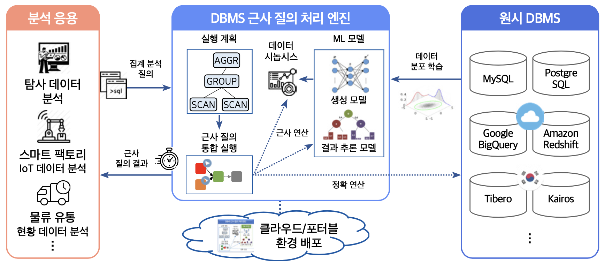

TrainDB란?
==========

TrainDB는 머신 러닝 기반으로 정확한 분석 결과에 준하는 근사 결과를 다양한 호스팅 환경에서 고속 제공하기 위한 탐사 데이터 분석 지원 DBMS 근사 질의 처리 엔진이다.

TrainDB의 특징은 다음과 같다.

* ML 모델을 학습한 이후에는 원시 데이터에 접근하지 않고 근사 질의 결과 제공
* 원격 머신 러닝 서비스와 연동하여 ML 모델 학습/실행 가능
* 다양한 DBMS를 원시 DBMS로 연동하여 데이터 분석 질의 수행
